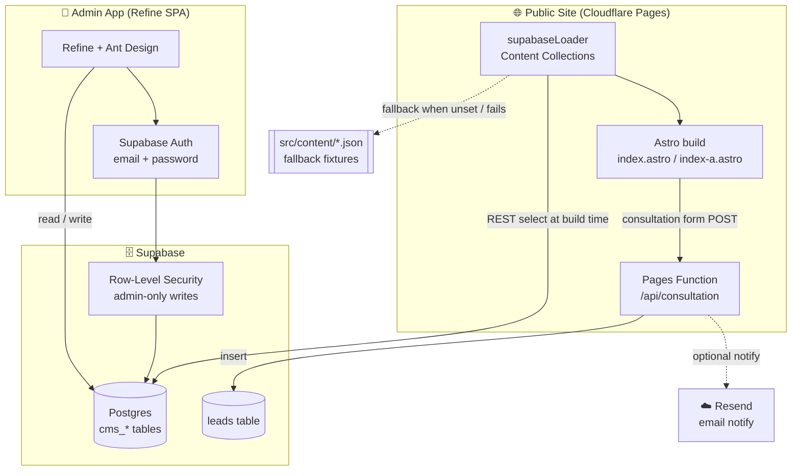
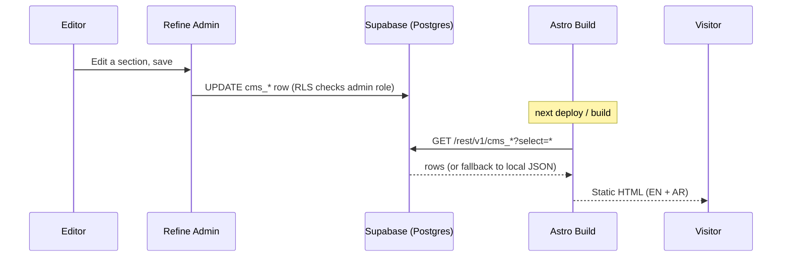

<div align="center">

# YG-Auditors Website

**Professional accounting & auditing firm website — bilingual (EN/AR), animated, built with Astro v6 and backed by a Supabase-powered admin CMS.**

[](https://astro.build)
[](https://www.typescriptlang.org)
[](https://gsap.com)
[](https://refine.dev)
[](https://supabase.com)
[](https://github.com/EbrahimHeggy/yg-auditors-website/actions/workflows/build.yml)

_Last updated: 2026-06-23_

</div>

---

## ✨ Features

- **Bilingual (EN / AR)** — full English and Arabic content with RTL layout support
- **GSAP scroll animations** — entrance and parallax effects on every section via ScrollTrigger, with below-the-fold animations lazy-loaded for Core Web Vitals
- **Living Earth globe** — reusable canvas-rendered spinning globe (`LivingEarth.astro`) used as both the Hero background and the Services panel; Egyptian city names appear one-by-one at random positions across the sphere and fade in/out independently, draggable by mouse/touch
- **Animated process timeline** — `Process.astro` renders a zigzag SVG path with a continuously flowing light effect and pulsing dots; each dot sits exactly on the curve, shows its step name underneath, and reveals the full description on hover/tap
- **Component architecture** — every page section is an isolated Astro component with scoped CSS
- **Supabase-backed content** — all editable copy (hero, about, services, team, contact info, …) lives in `cms_*` Postgres tables and is fetched at build time via a custom Astro Content Collections loader
- **Graceful local fixtures** — when Supabase env vars aren't set (or a fetch fails), the loader falls back to the committed JSON files in `src/content/`, so the site always builds
- **Refine admin app** — a standalone React SPA (`admin-app/`) built on [Refine](https://refine.dev) + Ant Design gives non-technical editors auto-generated forms for every content table
- **Supabase Auth + admin-only RLS** — editors sign in with email/password; row-level security restricts all CMS writes to users carrying an `admin` role in their JWT `app_metadata`, while the public site reads anonymously
- **Lead capture** — the consultation form posts to a Cloudflare Pages Function (`functions/api/consultation.ts`) that validates the payload, stores it in a Supabase `leads` table, and (optionally) emails a notification via [Resend](https://resend.com); includes a honeypot field, length limits, and bilingual success/error states
- **Dark theme** — unified dark palette (`#08091A`) with purple accent throughout
- **Mostly static output** — the public site is a static build; the only server-side code is the single consultation Pages Function. The admin app is a separately built SPA

---

## 🏗️ Architecture



### Content flow



---

## 🛠️ Tech Stack

| Category | Technology |
|----------|------------|
| **Site framework** | Astro 6.4 (static output) |
| **Language** | TypeScript 5 |
| **Styling** | Scoped component CSS + Tailwind CSS 4 (via `@tailwindcss/vite`) |
| **Animations** | GSAP 3.15 + ScrollTrigger, AOS, Motion, Lottie |
| **Canvas** | Native Canvas 2D API (globe) |
| **Content** | Astro Content Collections (`src/content.config.ts`, Zod-validated) via custom `supabaseLoader` |
| **CMS / data** | Supabase (Postgres + Auth + RLS) |
| **Admin app** | Refine 4 + Ant Design 5, React 18, React Router 7, Vite 5 |
| **Serverless** | Cloudflare Pages Functions (`functions/api/consultation.ts`) |
| **Email** | Resend (optional lead notifications) |
| **Fonts** | Inter (EN), Cairo (AR) |
| **Build tool** | Vite (via Astro; standalone Vite for the admin app) |
| **Hosting** | Cloudflare Pages (public site + Function) |
| **CI** | GitHub Actions (build check + README auto-update) |

---

## 📁 Project Structure

```
yg-auditors-website/
├── .github/
│   └── workflows/
│       ├── build.yml               # Builds the site on every push/PR (status badge above)
│       └── update-readme.yml       # Auto-commits the "Last updated" date on push to master
├── admin-app/                      # Standalone Refine + Supabase admin SPA
│   ├── src/
│   │   ├── App.tsx                 # Refine setup: resources, auth gate, routes
│   │   ├── fields.ts               # Field schemas + labels for every cms_* resource
│   │   ├── components/
│   │   │   └── SchemaForm.tsx      # Renders Ant Design form fields from fields.ts
│   │   ├── pages/                  # ResourceList / ResourceCreate / ResourceEdit
│   │   ├── providers/
│   │   │   └── authProvider.ts     # Supabase email/password auth
│   │   └── utility/
│   │       └── supabaseClient.ts   # Supabase client (VITE_SUPABASE_* env)
│   └── .env.example                # VITE_SUPABASE_URL, VITE_SUPABASE_KEY
├── functions/
│   └── api/
│       └── consultation.ts         # Cloudflare Pages Function: validate → insert lead → notify
├── supabase/
│   └── migrations/
│       ├── 0001_create_leads.sql                # leads table + anon-insert-only RLS
│       ├── 0002_create_cms_content_tables.sql   # cms_* tables + base RLS
│       ├── 0003_seed_cms_content.sql            # initial content seed
│       └── 0004_restrict_cms_write_to_admins.sql# admin-role-only write policy
├── docs/
│   └── pr-evidence/                # Screenshots of the consultation form working
├── src/
│   ├── components/                 # One file per page section (Header, Hero, About,
│   │                               #   Services, LivingEarth, Process, Team, Contact, …)
│   ├── content/                    # Fallback JSON fixtures (used when Supabase is unset)
│   │   ├── sections/               # hero.json, about.json, services.json, …
│   │   ├── team/                   # One JSON file per team member
│   │   └── contact-info.json
│   ├── content.config.ts           # Content Collections + Zod schemas, wired to supabaseLoader
│   ├── lib/
│   │   └── supabase-loader.ts      # Build-time Supabase REST fetch with local-JSON fallback
│   ├── data/                       # Static (non-CMS) site data as JSON
│   ├── layouts/
│   │   └── Layout.astro            # Root HTML shell, global fonts
│   ├── pages/
│   │   ├── index.astro             # English homepage
│   │   └── index-a.astro           # Arabic homepage
│   ├── scripts/
│   │   └── lazy-section.ts         # Lazy-loads below-fold section animations
│   └── styles/
│       └── global.css              # CSS custom properties, resets, shared utilities
├── astro.config.mjs                # i18n (en/ar), Tailwind Vite plugin, site URL
├── .env.example                    # SUPABASE_URL, SUPABASE_ANON_KEY (site build)
├── .dev.vars.example               # Pages Function vars for local `wrangler pages dev`
└── package.json
```

---

## 🚀 Getting Started

> [!NOTE]
> This repo contains **two apps**: the public Astro site (root) and the Refine admin SPA (`admin-app/`). Each has its own `package.json` and `.env`.

**Prerequisites:** Node.js 22.12+ (required by Astro 6), npm 9+

### Public site

```bash
git clone <repo-url>
cd yg-auditors-website
npm install

cp .env.example .env        # add SUPABASE_URL + SUPABASE_ANON_KEY (optional for local dev)
npm run dev                 # http://localhost:4321
```

```bash
npm run build               # outputs to dist/
npm run preview             # preview production build
```

> [!TIP]
> The site builds fine **without** Supabase credentials — the content loader falls back to the JSON fixtures in `src/content/`.

### Admin app

```bash
cd admin-app
npm install

cp .env.example .env        # add VITE_SUPABASE_URL + VITE_SUPABASE_KEY
npm run dev                 # http://localhost:5173
```

```bash
npm run build               # type-check + production build
```

---

## ⚙️ Environment Variables

### Public site (`.env`)

| Variable | Purpose |
|----------|---------|
| `SUPABASE_URL` | Supabase project URL — used by the build-time content loader |
| `SUPABASE_ANON_KEY` | Supabase anon key — anonymous read access to `cms_*` tables |

### Admin app (`admin-app/.env`)

| Variable | Purpose |
|----------|---------|
| `VITE_SUPABASE_URL` | Supabase project URL |
| `VITE_SUPABASE_KEY` | Supabase anon key (auth + data, gated by RLS) |

### Consultation Pages Function (`.dev.vars` locally / Cloudflare env in prod)

| Variable | Required | Purpose |
|----------|----------|---------|
| `SUPABASE_URL` | ✅ | Supabase project URL — where leads are inserted |
| `SUPABASE_ANON_KEY` | ✅ | Supabase anon key (insert-only on `leads` per RLS) |
| `RESEND_API_KEY` | optional | Resend API key; if unset, email notifications are skipped |
| `LEAD_NOTIFY_EMAIL` | optional | Address that receives new-lead notification emails |

---

## 🗄️ Supabase Setup

1. Create a Supabase project.
2. In the SQL editor, run the migrations in order:
   `supabase/migrations/0001_create_leads.sql` →
   `0002_create_cms_content_tables.sql` →
   `0003_seed_cms_content.sql` →
   `0004_restrict_cms_write_to_admins.sql`.
3. Create a user for each content editor (Authentication → Users), then grant the
   `admin` role so RLS lets them write:

   ```sql
   update auth.users
   set raw_app_meta_data = raw_app_meta_data || '{"roles": ["admin"]}'::jsonb
   where email = 'editor@example.com';
   ```

4. Set the env vars above for both apps.

> [!WARNING]
> Without the `admin` role on their JWT, an authenticated user can read but **cannot** write any `cms_*` content (policy added in migration `0004`).

---

## 🌐 Internationalization

| Page | Language | Direction |
|------|----------|-----------|
| `/index.html` | English | LTR |
| `/index-a.html` | Arabic | RTL |

Each component accepts a `lang` prop (`"en"` or `"ar"`) and renders the matching content from the Supabase-loaded collections or the static JSON data files.

---

## 📦 Deployment

- **Public site** — deployed to **Cloudflare Pages** (build command `npm run build`,
  output dir `dist/`). The `functions/` directory is auto-detected and deployed as a
  Pages Function, so `/api/consultation` runs alongside the static pages. Set
  `SUPABASE_URL` and `SUPABASE_ANON_KEY` (and optionally `RESEND_API_KEY` /
  `LEAD_NOTIFY_EMAIL`) in the Pages project's environment variables. `astro.config.mjs`
  sets the canonical `site` URL and the `en`/`ar` i18n locales.
- **Admin app** — `cd admin-app && npm run build` produces a static SPA; deploy it
  separately (its own subdomain/host) with `VITE_SUPABASE_*` configured.
- **Content updates** — editors save changes in the admin app, then a new site build
  (manual or auto-triggered) re-fetches the updated rows.
- **Local Function testing** — copy `.dev.vars.example` to `.dev.vars`, then run the
  built site through `npx wrangler pages dev dist` to exercise `/api/consultation`
  end-to-end.

### CI

- **`.github/workflows/build.yml`** — runs `npm ci && npm run build` on Node 22 for
  every push/PR to `master` as a sanity check; status shown by the badge at the top.
- **`.github/workflows/update-readme.yml`** — after a successful push to `master`,
  refreshes the "Last updated" date in this README and commits it back (skipped for
  its own commits to avoid looping).
