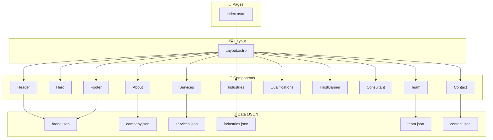

<div align="center">

# YG-Auditors Website

**Professional accounting & auditing firm website — bilingual (EN/AR), animated, built with Astro v6.**

[](https://astro.build)
[](https://www.typescriptlang.org)
[](https://tailwindcss.com)
[](https://gsap.com)

</div>

---

## ✨ Features

- **Bilingual (EN / AR)** — full English and Arabic content with RTL layout support for Arabic
- **GSAP scroll animations** — smooth entrance and parallax effects on all major sections
- **Data-driven content** — all copy, services, team, and industries managed in JSON files under `src/data/`
- **Component architecture** — every page section is an isolated Astro component
- **Scoped CSS** — per-component styles, no global CSS conflicts
- **Tailwind CSS v4** — utility classes available via the Vite plugin (no config file needed)
- **Static output** — zero server runtime; deploys to any static host

---

## 🏗️ Architecture



---

## 🛠️ Tech Stack

| Category | Technologies |
|----------|-------------|
| **Framework** | Astro 6.4 (static output) |
| **Language** | TypeScript 5.6 (strict mode) |
| **Styling** | Tailwind CSS 4.3 (via Vite plugin), scoped component CSS |
| **Animations** | GSAP 3.15, AOS 2.3, Motion 12 |
| **Fonts** | Inter (EN), Cairo (AR) |
| **i18n** | Astro built-in i18n routing (EN default, AR) |
| **Build tool** | Vite (via Astro) |
| **Deploy target** | Static hosting (e.g., Netlify, Vercel, cPanel) |

---

## 📁 Project Structure

```
yg-auditors-website/
├── src/
│   ├── components/           # One file per page section
│   │   ├── Header.astro
│   │   ├── Hero.astro
│   │   ├── About.astro
│   │   ├── Services.astro
│   │   ├── Industries.astro
│   │   ├── Team.astro
│   │   ├── Qualifications.astro
│   │   ├── TrustBanner.astro
│   │   ├── Consultant.astro
│   │   ├── Contact.astro
│   │   └── Footer.astro
│   ├── data/                 # All site content as JSON
│   │   ├── brand.json        # Colors, fonts, logo, languages
│   │   ├── company.json      # Mission, vision, stats
│   │   ├── services.json     # 5 service offerings (EN + AR)
│   │   ├── industries.json   # 3 client categories (EN + AR)
│   │   ├── team.json         # Team member profiles
│   │   └── contact.json      # Address, phone, email
│   ├── layouts/
│   │   └── Layout.astro      # Root HTML shell, global fonts
│   ├── pages/
│   │   └── index.astro       # Single-page site entry point
│   └── styles/
│       └── global.css        # CSS custom properties, resets
├── public/                   # Static assets (images, favicon, PDF)
├── astro.config.mjs          # Astro + i18n + Vite/Tailwind config
├── tsconfig.json             # Path aliases (@data, @components, @layouts)
└── package.json
```

---

## 🚀 Getting Started

### Prerequisites

- Node.js 18+
- npm 9+

### Installation

```bash
# Clone the repository
git clone <repo-url>
cd yg-auditors-website

# Install dependencies
npm install

# Start the development server
npm run dev
```

Open [http://localhost:4321](http://localhost:4321) in your browser.

### Build for production

```bash
npm run build       # outputs to dist/
npm run preview     # preview the production build locally
```

---

## 🌐 Internationalization

The site uses Astro's built-in i18n with two locales:

| Locale | Language | Direction |
|--------|----------|-----------|
| `en` (default) | English | LTR |
| `ar` | Arabic | RTL |

All user-facing strings live in the JSON files under `src/data/` as `{ "en": "...", "ar": "..." }` objects. Components receive the active locale and render the appropriate string.

---

## 📦 Deployment

The site outputs fully static HTML to `dist/` after `npm run build`. Deploy to any static host:

- **Netlify / Vercel** — connect the repo; set build command `npm run build`, publish dir `dist`
- **cPanel / shared hosting** — upload the contents of `dist/` to `public_html`
- **Custom domain** — configured in `astro.config.mjs` under `site: 'https://yg-auditors.com'`

---

## 🔧 Customizing Content

All content changes go through the JSON data files — no component code edits needed for copy updates:

| What to change | File |
|----------------|------|
| Brand colors, logo, fonts | `src/data/brand.json` |
| Company mission, stats | `src/data/company.json` |
| Services (add/edit/remove) | `src/data/services.json` |
| Industries served | `src/data/industries.json` |
| Team members | `src/data/team.json` |
| Contact info | `src/data/contact.json` |

---

## 📄 License

© 2025 Youssef Galal Accounting & Auditing Office. All rights reserved.

Developed by **Trioplus**.
